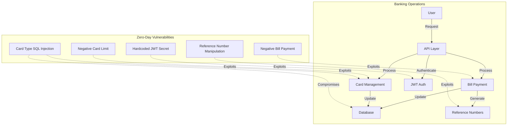
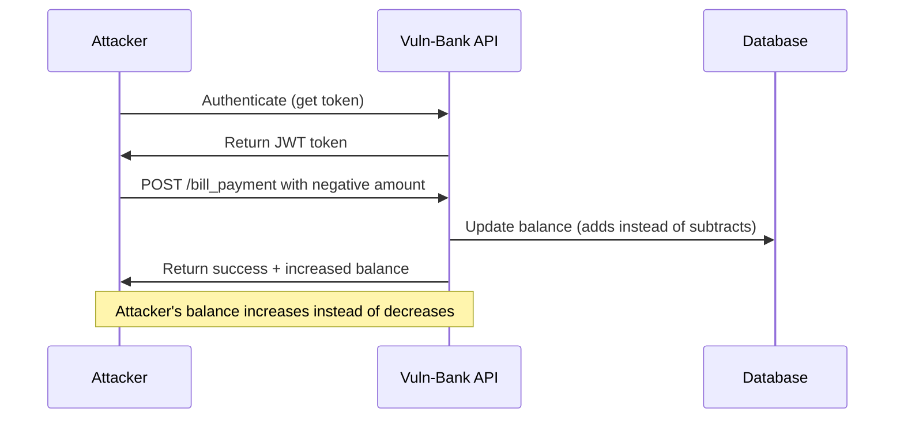
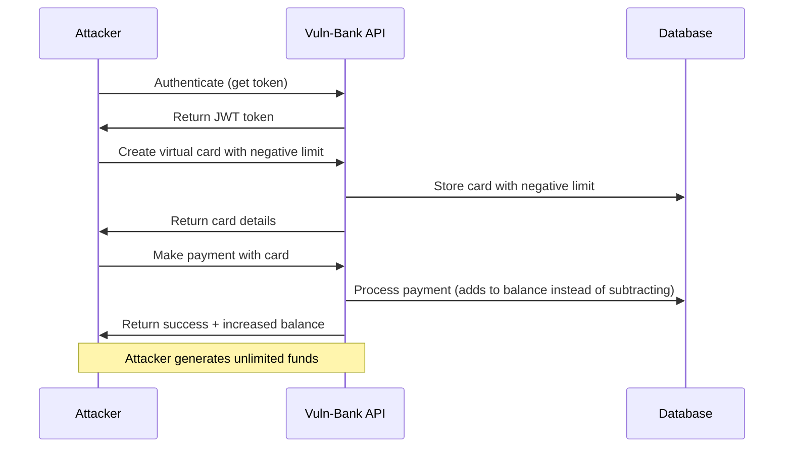
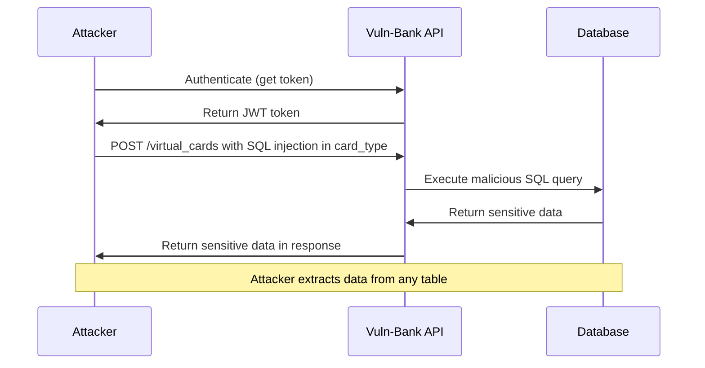
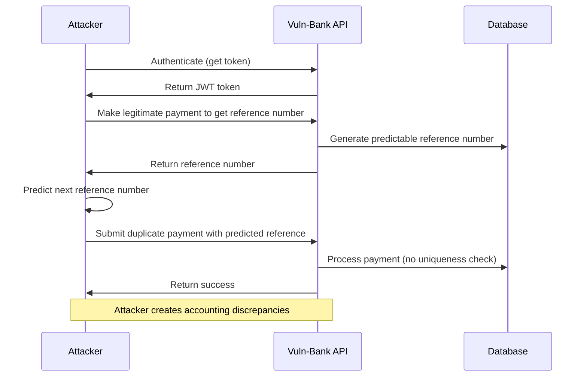
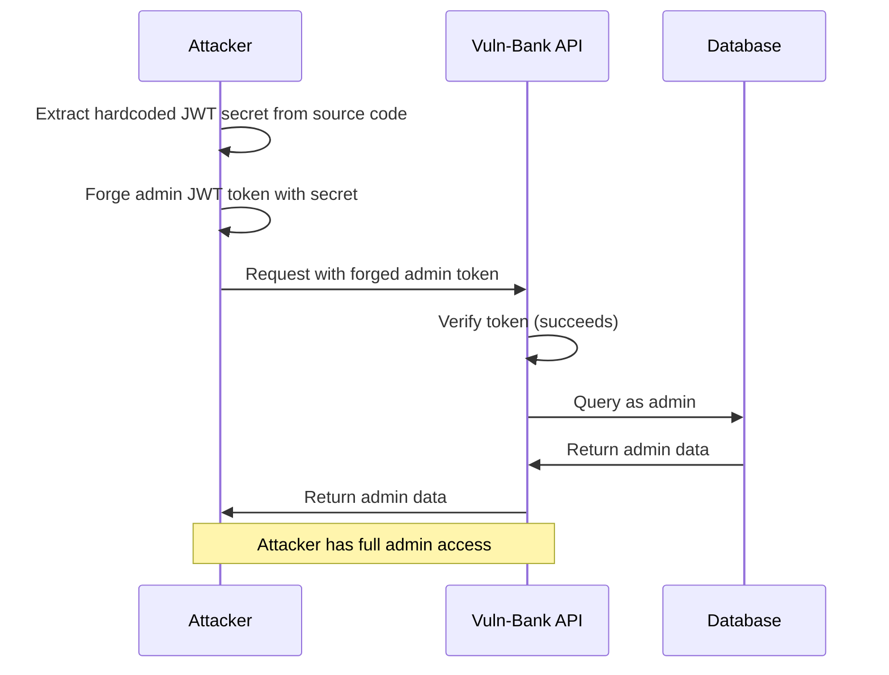

# Zero-Day Vulnerabilities

This directory contains the findings and exploit scripts for zero-day vulnerabilities discovered in the Vuln-Bank application. These are vulnerabilities that weren't documented or previously known.

## Architecture Diagram

The diagram above illustrates the banking operations in the Vuln-Bank application and how the zero-day vulnerabilities can be exploited to compromise the system.

## Vulnerabilities Overview

1. **Negative Bill Payment**: The application doesn't validate if payment amounts are negative, allowing attackers to increase their account balance by making negative payments.
2. **Negative Card Limit**: The application doesn't validate if card limits are negative, providing another method to generate unlimited funds.
3. **Card Type SQL Injection**: The application doesn't properly sanitize the `card_type` parameter, allowing SQL injection attacks.
4. **Reference Number Manipulation**: The application generates predictable reference numbers and doesn't enforce uniqueness constraints.
5. **Hardcoded JWT Secret Key**: The JWT secret key is hardcoded in the source code, allowing attackers to forge valid tokens.

## Attack Flow Diagrams

### Negative Bill Payment Attack Flow

### Negative Card Limit Attack Flow

### Card Type SQL Injection Attack Flow

### Reference Number Manipulation Attack Flow

### Hardcoded JWT Secret Attack Flow

## Exploit Scripts

The following exploit scripts demonstrate how to exploit each vulnerability:

- [negative_bill_payment/exploit.py](./negative_bill_payment/exploit.py): Exploits negative bill payment vulnerability to increase account balance
- [negative_card_limit/exploit.py](./negative_card_limit/exploit.py): Exploits negative card limit vulnerability
- [card_type_sqli/exploit.py](./card_type_sqli/exploit.py): Exploits SQL injection in card_type parameter
- [reference_number_manipulation/exploit.py](./reference_number_manipulation/exploit.py): Exploits reference number manipulation vulnerability
- [hardcoded_jwt_secret_exploit.py](./hardcoded_jwt_secret_exploit.py): Exploits the hardcoded JWT secret key to forge tokens

## Remediation Recommendations

1. **Validate Payment Amounts**: Ensure payment amounts are positive and within reasonable limits.
2. **Validate Card Limits**: Ensure card limits are positive and within allowed ranges.
3. **Parameterize SQL Queries**: Use parameterized queries for all database operations.
4. **Secure Reference Number Generation**: Use cryptographically secure random numbers for reference numbers and enforce uniqueness.
5. **Secure JWT Implementation**: Use environment variables and strong secrets for JWT implementation.
