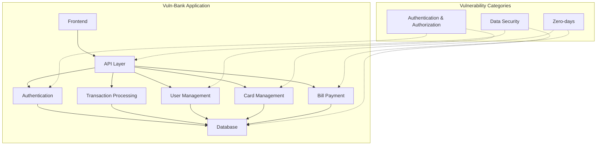
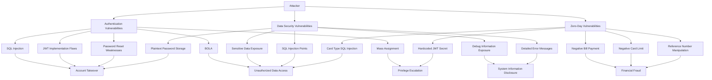

# Vuln-Bank Security Assessment

This repository contains the findings and exploit scripts from an AI-powered penetration test of the Vuln-Bank application using Cline.

## Architecture Overview

The diagram above shows the high-level architecture of the Vuln-Bank application and how the different vulnerability categories relate to the application components.

## Overview

Vuln-Bank is a (fictional) banking application with numerous security vulnerabilities. This repository documents the vulnerabilities discovered during the assessment, including:

- Authentication and Authorization vulnerabilities
- Data Security issues
- Zero-day vulnerabilities

Each section includes detailed explanations of the vulnerabilities, proof-of-concept exploit scripts, and remediation recommendations.

## Attack Flow Overview

Below is a high-level overview of how the different vulnerability categories can be exploited:

## Repository Structure

- [Authentication and Authorization](./authentication-authorization/): Vulnerabilities related to authentication and authorization mechanisms
- [Data Security](./data-security/): Vulnerabilities related to data handling and storage
- [Zero-days](./0days/): Previously undocumented vulnerabilities discovered during the assessment

## Methodology

The assessment used a combination of static analysis and dynamic penetration testing:

- **Static Analysis**: Examining the source code to identify potential vulnerabilities
- **Dynamic Testing**: Verifying the exploitability of identified vulnerabilities in a running environment

This combined approach provided several advantages:
- **Efficiency**: Static analysis allowed for rapid identification of potential vulnerabilities
- **Comprehensiveness**: Dynamic testing verified the exploitability of the identified vulnerabilities
- **Root Cause Analysis**: Code-level insights made it easier to understand underlying causes
- **Better Remediation**: More precise remediation recommendations could be provided

## About the Author

Rotimi Akinyele is a cybersecurity leader, ethical hacker, and AI security enthusiast. He's the founder of NaijaSecForce and currently serves as Head of Security at a global fintech platform processing over $600 billion monthly and protecting more than 3 million customers. Rotimi is Nigeria's first OSCE/OSCP, a CISSP, and a Harvard-trained cybersecurity strategist with 17+ years of experience leading red team operations, securing critical systems, and pushing the boundaries of AI in offensive security.

He's passionate about using AI to rethink how we break and secure applications — faster, smarter, and more creatively.

Follow his work at [NaijaSecForce.com](https://NaijaSecForce.com) or connect on [LinkedIn](https://linkedin.com/in/rotimiakinyele).

## Disclaimer

This repository is for educational purposes only. The vulnerabilities and exploits described are based on common security issues found in real-world applications, but the specific implementation details are fictional. Do not use these techniques against systems without proper authorization.
