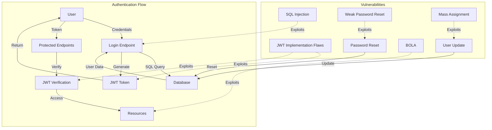
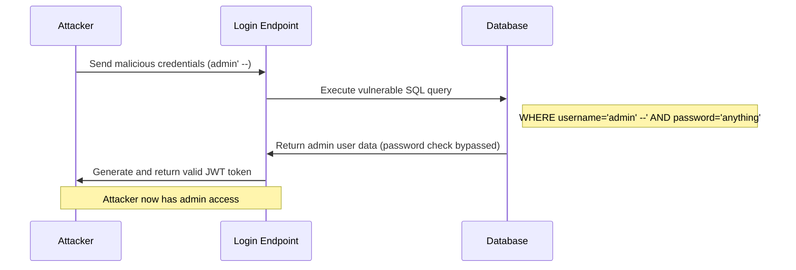
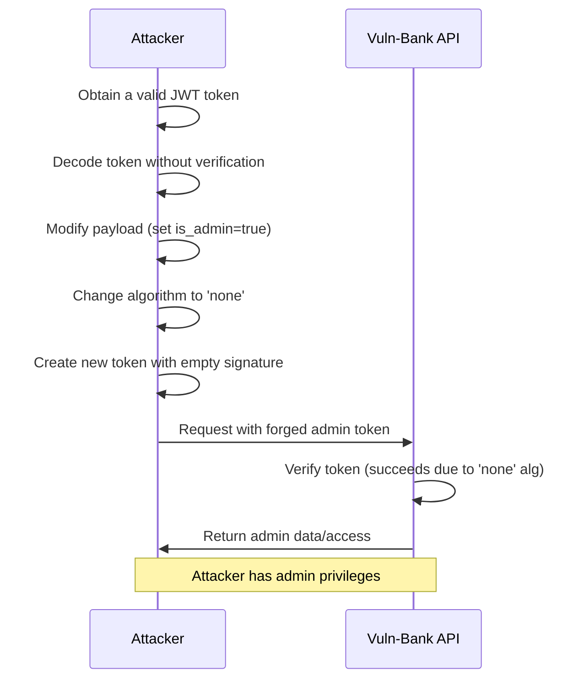
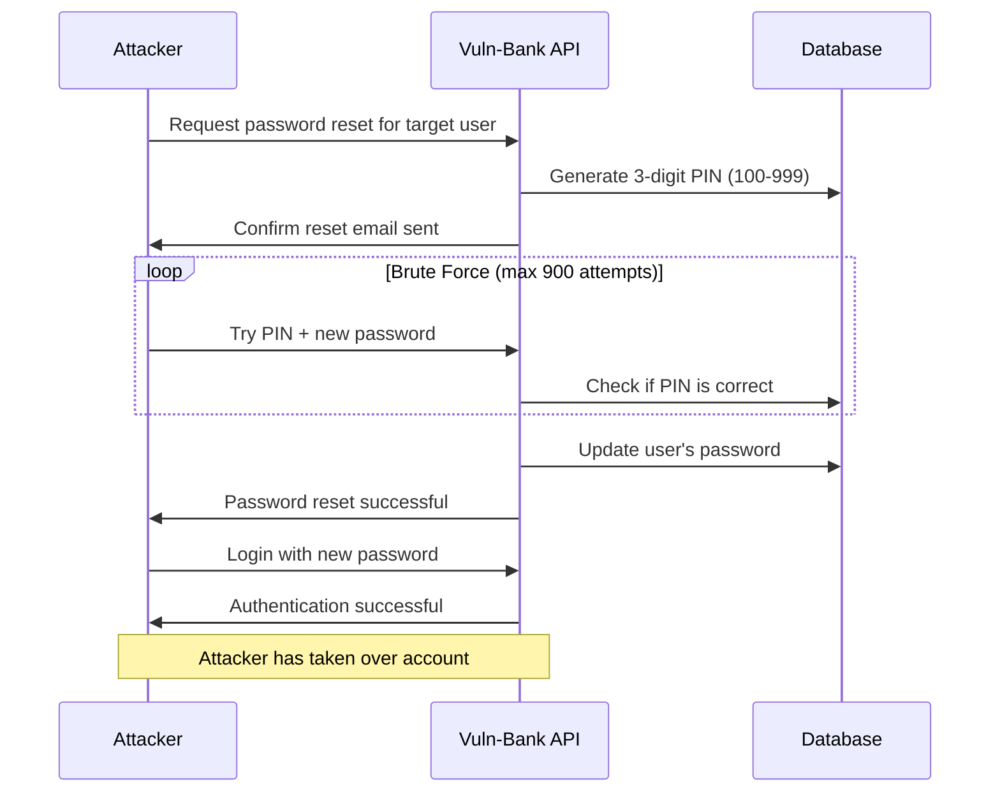
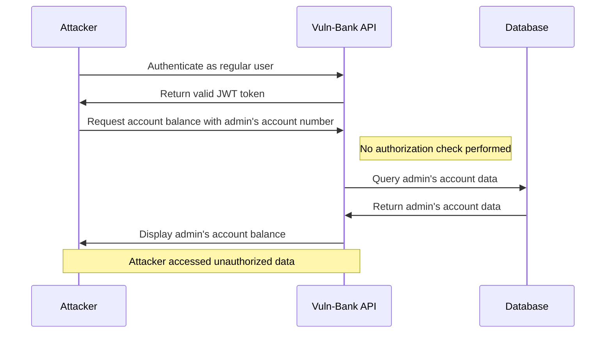
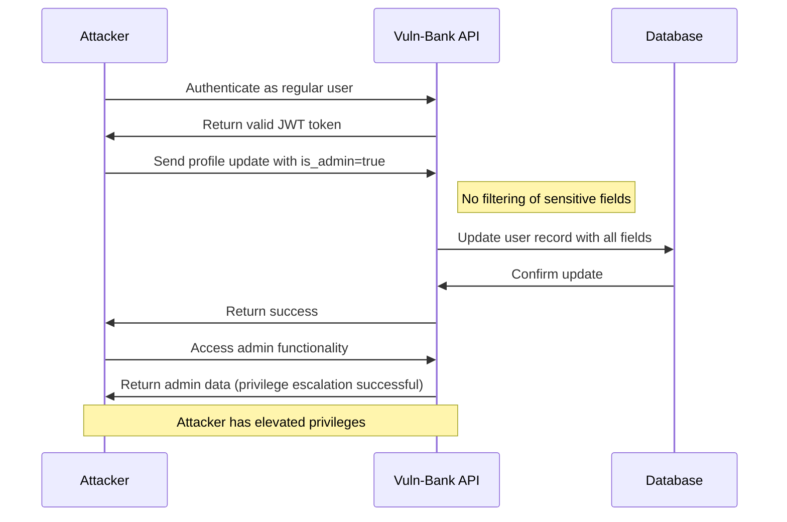

# Authentication and Authorization Vulnerabilities

This directory contains the findings and exploit scripts for authentication and authorization vulnerabilities discovered in the Vuln-Bank application.

## Architecture Diagram

The diagram above illustrates the authentication flow in the Vuln-Bank application and how different vulnerabilities can be exploited to bypass security controls.

## Vulnerabilities Overview

1. **SQL Injection in Login**: The login functionality is vulnerable to SQL injection, allowing complete authentication bypass.
2. **JWT Implementation Flaws**: Multiple issues with JWT implementation including weak secret key, vulnerable algorithm selection, and no token expiration.
3. **Weak Password Reset Mechanism**: The password reset functionality uses a 3-digit PIN, making it easily brute-forceable.
4. **Broken Object Level Authorization (BOLA)**: The application fails to verify if the authenticated user has permission to access resources.
5. **Mass Assignment**: The application blindly binds client-provided data to internal objects without proper filtering.

## Attack Flow Diagrams

### SQL Injection Attack Flow

### JWT None Algorithm Attack Flow

### Password Reset Attack Flow

### BOLA Attack Flow

### Mass Assignment Attack Flow

## Exploit Scripts

The following exploit scripts demonstrate how to exploit each vulnerability:

- [sql_injection_login.py](./sql_injection_login.py): Exploits SQL injection in login functionality to bypass authentication
- [jwt_none_algorithm.py](./jwt_none_algorithm.py): Exploits the 'none' algorithm vulnerability in JWT implementation
- [jwt_weak_secret.py](./jwt_weak_secret.py): Exploits the weak JWT secret key to forge admin tokens
- [password_reset_bruteforce.py](./password_reset_bruteforce.py): Brute forces the weak password reset PIN
- [bola_exploit.py](./bola_exploit.py): Exploits Broken Object Level Authorization to access another user's account information
- [mass_assignment_exploit.py](./mass_assignment_exploit.py): Exploits mass assignment vulnerability to elevate privileges

## Remediation Recommendations

1. **SQL Injection**: Replace string interpolation with parameterized queries.
2. **JWT Implementation**: Use a strong, randomly generated secret key, enforce token expiration, and remove the 'none' algorithm.
3. **Password Reset**: Use longer, more complex reset tokens with expiration times and implement rate limiting.
4. **Authorization**: Implement proper object-level authorization checks for all resources.
5. **Mass Assignment**: Use a whitelist of allowed properties for each endpoint.
