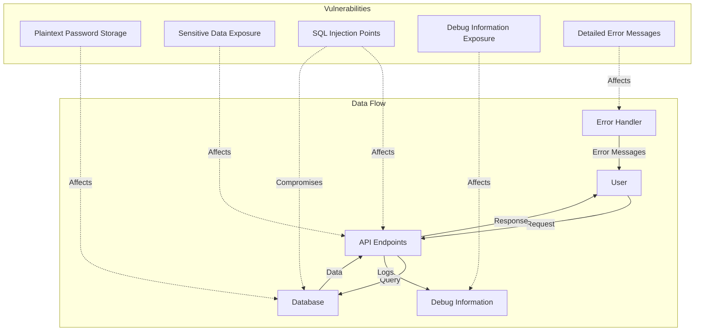
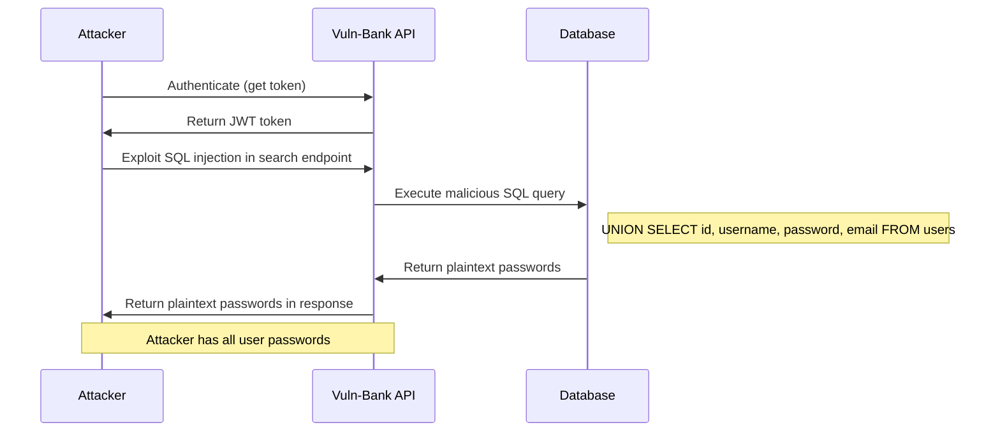
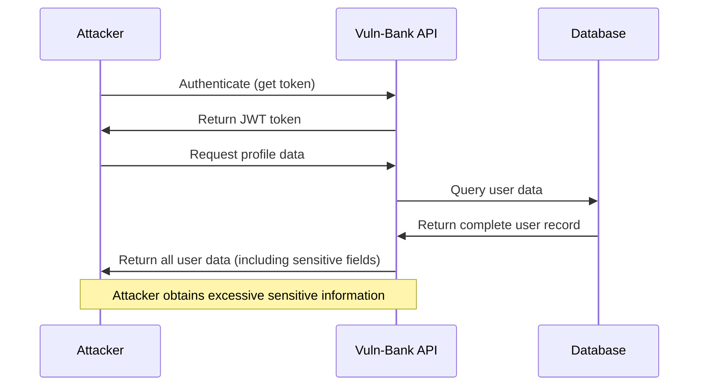
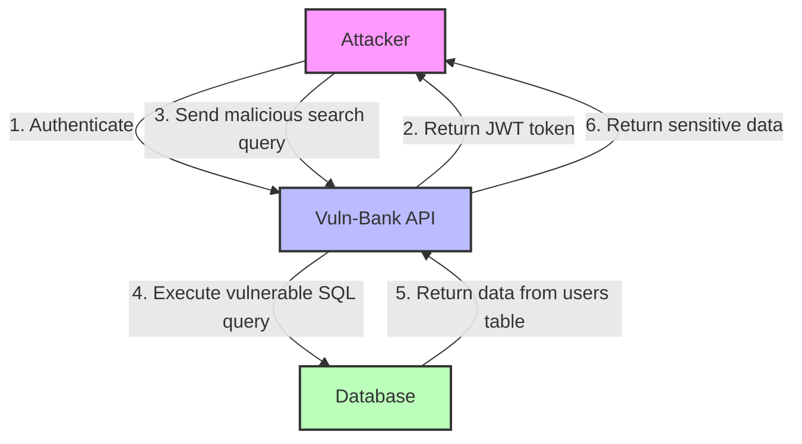
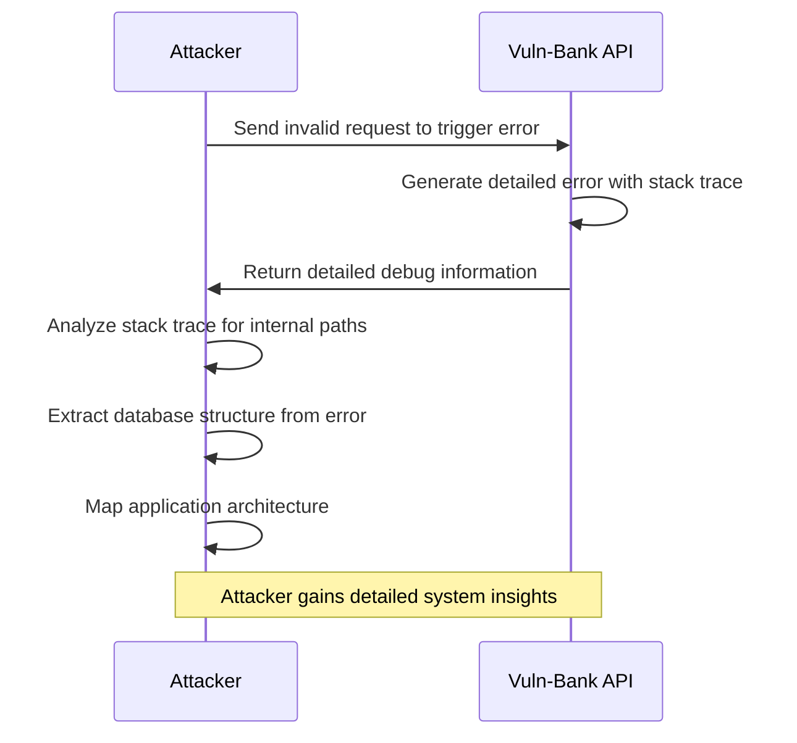
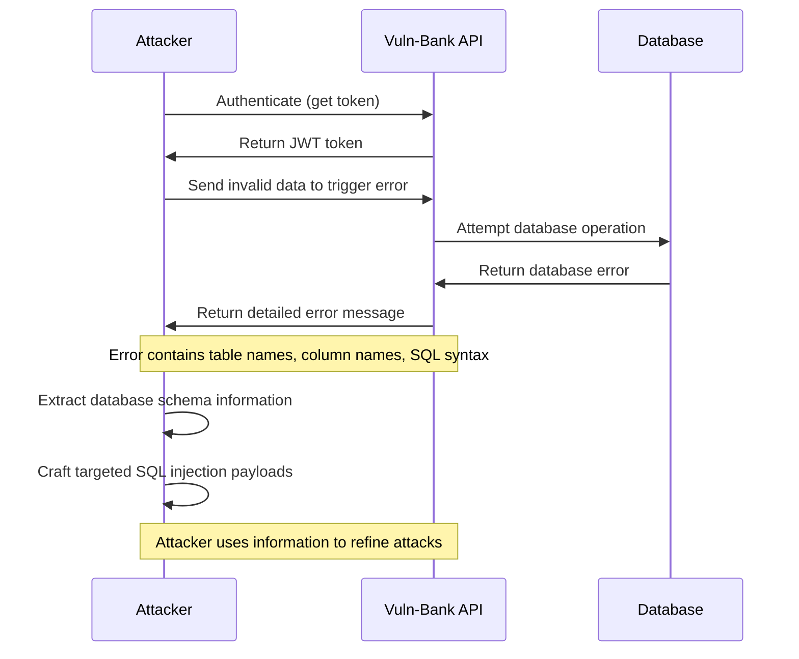

# Data Security Vulnerabilities

This directory contains the findings and exploit scripts for data security vulnerabilities discovered in the Vuln-Bank application.

## Architecture Diagram

The diagram above illustrates the data flow in the Vuln-Bank application and how different vulnerabilities can lead to data security breaches.

## Vulnerabilities Overview

1. **Plaintext Password Storage**: The application stores user passwords in plaintext, allowing attackers to directly access passwords if they gain access to the database.
2. **Sensitive Data Exposure**: The application exposes sensitive data in API responses, providing attackers with valuable information.
3. **SQL Injection Points**: Multiple SQL injection points were identified that could lead to unauthorized access to sensitive data.
4. **Debug Information Exposure**: The application exposes detailed debug information in production environments.
5. **Detailed Error Messages**: The application returns detailed error messages that reveal sensitive information.

## Attack Flow Diagrams

### Plaintext Password Storage Attack Flow

### Sensitive Data Exposure Attack Flow

### SQL Injection Attack Flow

### Debug Information Exposure Attack Flow

### Detailed Error Messages Attack Flow

## Exploit Scripts

The following exploit scripts demonstrate how to exploit each vulnerability:

- [plaintext_password_storage/exploit.py](./plaintext_password_storage/exploit.py): Extracts plaintext passwords from the database
- [sensitive_data_exposure/exploit.py](./sensitive_data_exposure/exploit.py): Extracts sensitive user data from the profile endpoint
- [sql_injection_points/exploit.py](./sql_injection_points/exploit.py): Exploits SQL injection to extract data from any table
- [debug_information_exposure/exploit.py](./debug_information_exposure/exploit.py): Gathers debug information by triggering errors
- [detailed_error_messages/exploit.py](./detailed_error_messages/exploit.py): Exploits detailed error messages to gather database information

## Remediation Recommendations

1. **Secure Password Storage**: Use bcrypt or another strong hashing algorithm with salt for password storage.
2. **Minimize Data Exposure**: Return only necessary data in API responses.
3. **Parameterized Queries**: Use parameterized queries for all database operations.
4. **Generic Error Handling**: Implement generic error messages that don't reveal sensitive information.
5. **Disable Debug Information**: Disable debug information in production environments.
